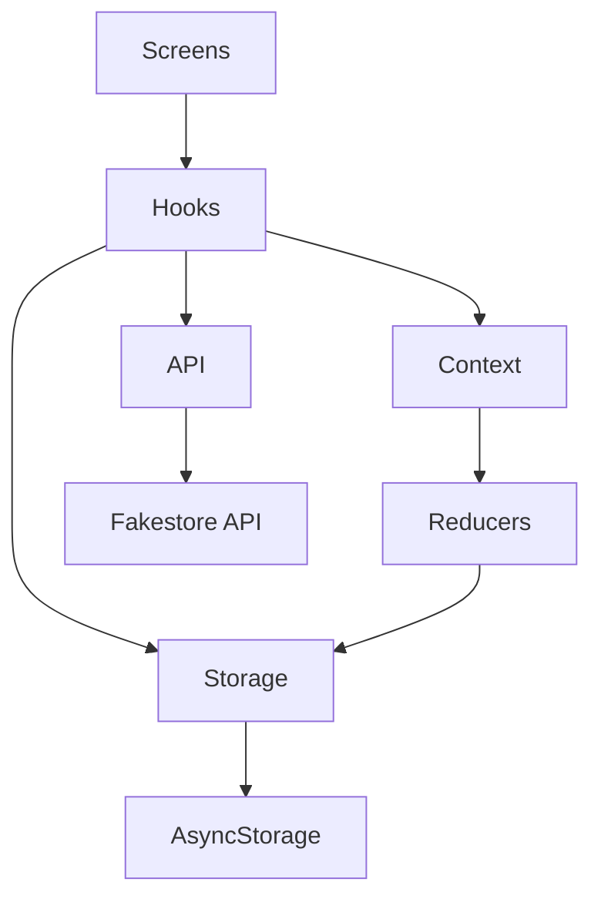

# 🛒 LocalMart – React Native E‑Commerce App

LocalMart is a **production-ready mobile e-commerce application** built using **React Native (Expo)**.  
It supports **offline product caching**, **cart & checkout**, **order history**, **pagination**, and a **clean scalable architecture**.

---

## 📱 Features

- 🏠 Product listing with **search & category filter**
- 📦 Pagination (10 → 20 → 30 items)
- 🛒 Cart management (add, update qty, remove)
- 💳 Checkout with validation (name, phone, address)
- 📜 Order history with order details
- 🔌 Offline-first product cache
- ⚡ Skeleton loaders
- 🎨 Modern UI with NativeWind (Tailwind CSS)

---

## 🧱 Architecture Diagram



### Explanation
- **Screens**: UI layer (Home, Cart, Checkout, Orders)
- **Hooks**: Business logic (`useProducts`, `useCart`)
- **Context + Reducers**: Global state management
- **Storage**: Offline persistence using AsyncStorage
- **API**: External product API

---

## 🗂 Project Structure

```
src/
├── api/
│   └── products.api.js
├── components/
│   ├── ProductCard.js
│   ├── CartItem.js
│   ├── OrderCard.js
│   ├── Skeleton loaders
├── context/
│   ├── cart/
│   └── orders/
├── hooks/
│   ├── useProducts.js
│   ├── useCart.js
│   └── useOffline.js
├── navigation/
│   ├── RootStack.js
│   └── BottomTabs.js
├── screens/
│   ├── HomeScreen.js
│   ├── CartScreen.js
│   ├── CheckoutScreen.js
│   ├── OrdersScreen.js
│   └── OrderDetailsScreen.js
├── storage/
│   ├── products.storage.js
│   ├── cart.storage.js
│   └── orders.storage.js
├── utils/
│   ├── calculations.js
│   ├── validators.js
│   └── constants.js
```

---

## 🔌 Offline Product Cache (Important)

LocalMart uses **AsyncStorage** to cache products locally.

### How it works:
1. App loads cached products instantly (fast startup)
2. Fetches fresh products from API
3. Updates cache in background
4. If internet fails → cached data still works

**Result:** App works even without internet 🚀

---

## ⚙️ Tech Stack

- **React Native (Expo)**
- **NativeWind (Tailwind CSS)**
- **React Navigation**
- **AsyncStorage**
- **Fakestore API**
- **Context API + Reducers**

---

## 🚀 Getting Started

### 1️⃣ Install dependencies
```bash
npm install
```

### 2️⃣ Start the app
```bash
npx expo start
```

### 3️⃣ Run on device/emulator
- Press **a** → Android
- Press **i** → iOS

---

## 🌐 API Used

- https://fakestoreapi.com/products

---

## 🧪 Pagination Logic

- Items per page: **10**
- Scroll loads: **10 → 20 → 30**
- Implemented using `FlatList.onEndReached`

---

## 🧠 Why this architecture?

- Clean separation of concerns
- Easy to scale
- Production-friendly
- Interview-ready
- Backend-ready

---

## 📌 Future Improvements

- Authentication
- Payment gateway
- Backend integration
- Push notifications

---

---

⭐ If you like this project, don’t forget to star the repo!
